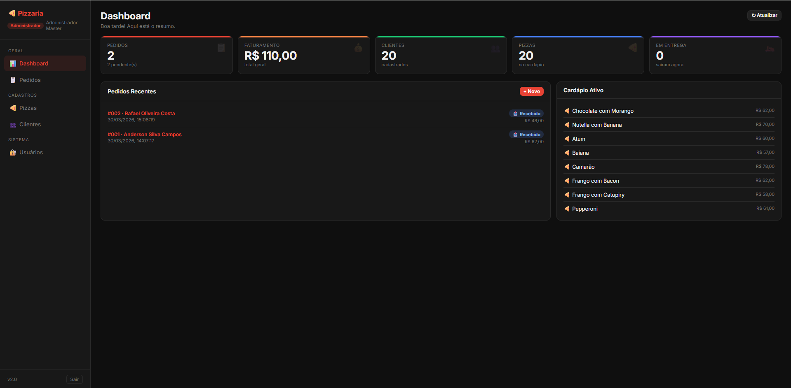
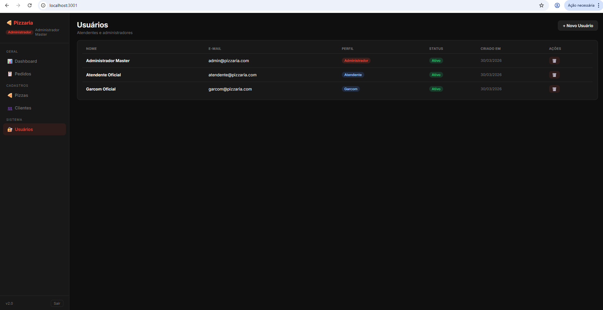
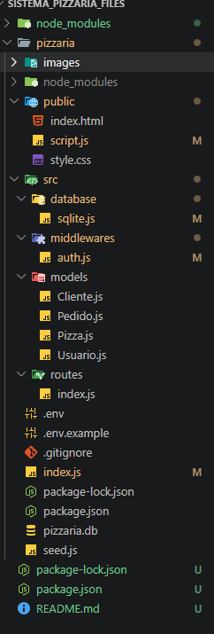

# Sistema de Pizzaria!

Vídeo do funcionamento | [💟 Vídeo do funcionamento do sistema ](https://drive.google.com/file/d/12-NvAyJ6HaMivS6_n2oj3kAlZudPp8e7/view?usp=sharing)

O sistema desenvolvido consiste em uma aplicação web para gerenciamento de uma pizzaria, permitindo o controle de pedidos, clientes, usuários e pizzas. A plataforma conta com autenticação utilizando:

- JWT (JSON Web Token), garantindo segurança no acesso, além de diferentes níveis de permissão, como Administrador, Atendente e Garçom. Cada perfil possui funcionalidades específicas, como gerenciamento de usuários, atendimento de pedidos e controle de mesas.

---

## Tecnologias utilizadas
O projeto foi construído utilizando tecnologias no front-end como:
- , 
- , 
- , 
- , 
- ,
- . 

Também foram utilizadas **bibliotecas** como **bcryptjs** para criptografia de senhas, **dotenv** para gerenciamento de variáveis de ambiente e cors para permitir a comunicação entre o servidor e o cliente, a instalação das bibliotecas é indispensável para o funcionamento do sistema.

### Pré-requisitos

Para executar o sistema, é necessário ter o Node.js e o npm instalados. Após clonar o repositório, deve-se instalar as dependências com o comando “npm install”, criar o arquivo .env com as variáveis de ambiente necessárias (como porta, chave secreta JWT e caminho do banco de dados), executar o script “node seed.js” para popular o banco e, por fim, iniciar o servidor com “node index.js”. O sistema pode ser acessado pelo navegador no endereço **http://localhost:3001**.

---
## Estruturação
A estrutura do projeto foi organizada em pastas específicas para melhor entendimento e manutenção. A pasta “public” contém os arquivos do front-end, enquanto a pasta **“src”** abriga o back-end, dividido em “database” para conexão com o banco, **“models”** para as regras de negócio, **“routes”** para as rotas da API e **“middlewares”** para autenticação.

---

## Instruções e descrições

**Entre as funcionalidades do sistema estão o login de usuários, o gerenciamento completo de pizzas e clientes, a criação e controle de pedidos, além de um módulo de mesas para garçons. Administradores podem gerenciar usuários, enquanto atendentes e garçons realizam operações relacionadas aos pedidos e atendimento**.

--- 
Durante o desenvolvimento, um dos principais desafios foi trabalhar com um código inicial desorganizado e sem documentação. Foi necessário aplicar técnicas de engenharia reversa para entender o funcionamento do sistema, analisando os caminhos dos “require()” e identificando a relação entre os arquivos. A partir disso, foi possível reorganizar corretamente a estrutura do projeto e garantir seu funcionamento.

Este projeto demonstra habilidades importantes como organização de código, desenvolvimento full stack, uso de Node.js com banco SQLite e, principalmente, a capacidade de compreender e reestruturar sistemas existentes através de engenharia reversa.
---

## Veja mais projetos de Raphaela e Mariana

| Projeto               |  Online                        |
|-----------------------|-------------------------------------|
| Githib da Raphaela | [🔗 Ver online](https://github.com/raphaelafelix) | 
| Github da Mariana | [🔗 Ver online](https://github.com/Marianaaayoub) | 

---